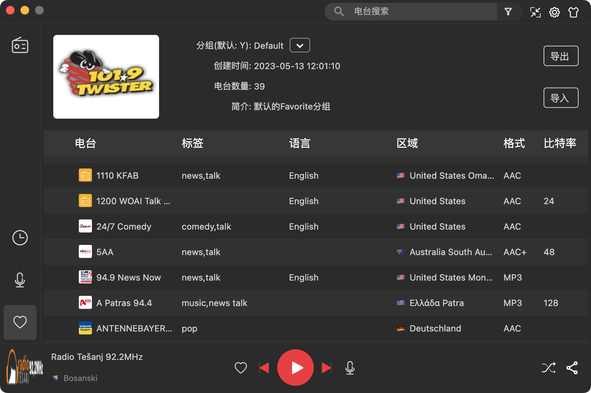
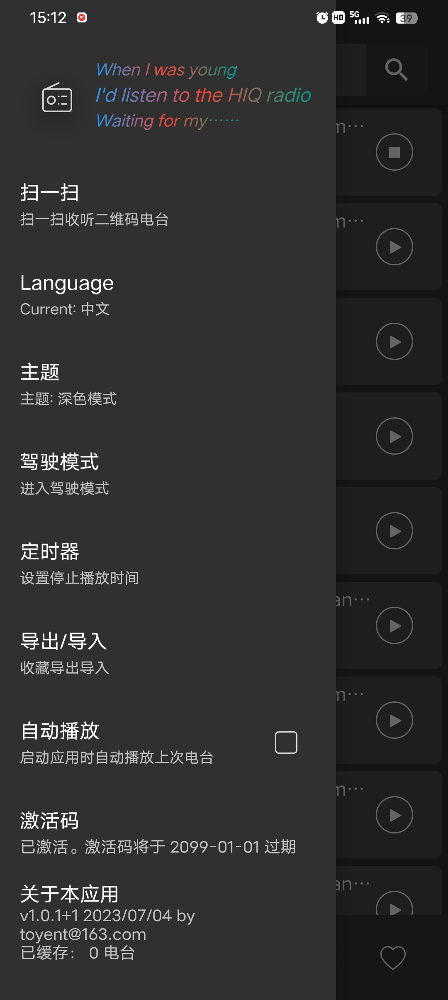
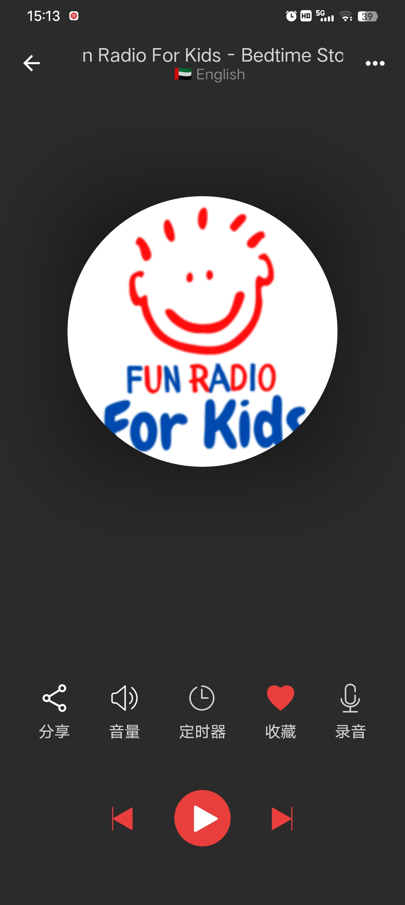
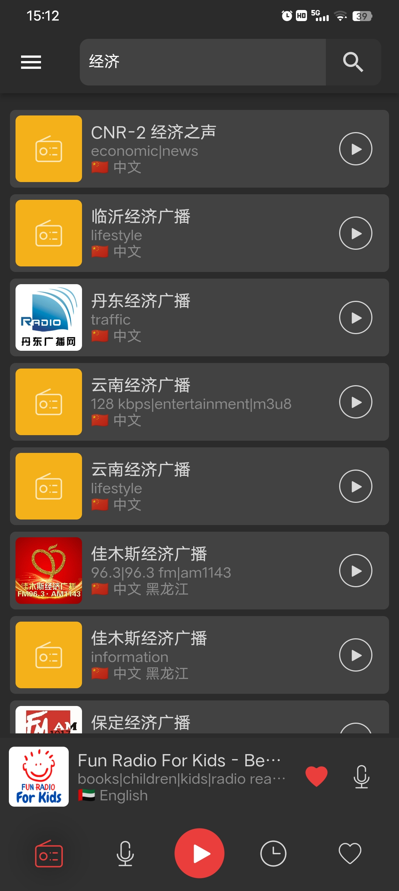

[English](README-en_US.md)

HiqRadio是一款简洁而功能强大的网络收音机，Api是来源于[OpenRadio](https://www.radio-browser.info/ "OpenRadio")，使用Flutter实现。所以，理论上他应该是跨平台的，同时支持Windows/Linux/Mac，或者android/ios。不过由于手头上只有2015款的丐版mac和android手机，所以只有在此两个平台测试，因此编译的release包也只有这两个平台，如果需要windows版本，之前有打包安装包：[release](https://github.com/buf1024/app-release/releases)。如果需要编译成其他平台，请自行下载代码编译。

Web也是支持的，不过Web版仅仅是为了完整性.在上面版本上做删改，很难做到一份代码同时编译到Web中, 所以Web版本在web分支之中，当然功能是相对简单很多的。体验: [https://luoguochun.cn/hiqradio/](https://luoguochun.cn/hiqradio/) 或
[https://buf1024.vercel.app/hiqradio](https://buf1024.vercel.app/hiqradio)。

同时为了各个平台同步播放列表和收藏夹，增加了同步功能。

### 主要功能

* 多平台同步
* 电台缓存/多功能搜索
* 播放历史/定时播放
* 录音/分组收藏/导出/导入
* 车载模式
* 智能系统托盘
* 等等……

### 功能截图

Desktop(Mac)：

<table>
    <tr>
     <td><center></center></td>
     <td><center></center></td>
    </tr>
</table>

Mobile (android)：

<table>
    <tr>
     <td><center></center></td>
     <td><center></center></td>
    </tr>
    <tr>
     <td><center></center></td>
     <td><center></center></td>
    </tr>
</table>​

‍

### 编译

```shel
## flutter 版本 其他版本不保证成功
$ flutter --version 
Flutter 3.13.0 • channel stable • git@github.com:flutter/flutter.git
Framework • revision efbf63d9c6 (4 weeks ago) • 2023-08-15 21:05:06 -0500
Engine • revision 1ac611c64e
Tools • Dart 3.1.0 • DevTools 2.25.

$ flutter pub get 
$ flutter gen-l10n 
$ flutter build macos --release

```

同时注意如果设置了<https://pub.flutter-io.cn获取库，偶尔会抽风，需要去掉并加梯子。>

生活不易，同时服务同步也需要成本，如果你喜欢[hiqradio](https://github.com/buf1024/hiqradio), 谢谢老板的赞赏!

<div align=center>
    
</div>
